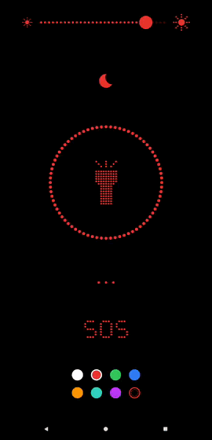

# Glyphlight

A minimal screen flashlight for Android. The whole UI is drawn as
dot-matrix glyphs on a pure black (OLED-friendly) background, with every accent
element following one user-selected color.

<p align="center">
  
</p>

## Features

- **Big torch button** — dotted ring + dot-matrix flashlight glyph. Tap to fill
  the screen with the selected color at the chosen brightness.
- **Brightness slider** — dotted, top of screen; sets the real screen backlight
  brightness (via the window's `screenBrightness` attribute), not just an overlay.
- **Sleep timer** — tap the moon glyph and pick a duration. It is staged, not
  started: the countdown begins when you switch the light on, and the idle
  screen shows the staged duration so you know one is set. While the light is
  on, tap the screen to reveal the time left directly underneath the brightness
  slider; tap that readout to cancel. Turning the light off early puts the timer
  back to staged, ready for the next press. When it elapses the flashlight turns
  off and the app stops holding the display awake, so the screen sleeps on your
  normal system timeout.

  Glyphlight cannot lock the screen instantly — Android reserves that for device
  admin and accessibility services, and this app requests no permissions.

- **SOS** — dot-matrix "SOS" label strobes the selected color in real Morse
  timing (`... --- ...`) until tapped again.
- **Color picker** — three-dot menu-adjacent quick swatches, plus a full
  HSL/RGB picker with hex entry, presets, and a saved-colors palette (with
  delete mode).
- **Settings** — brightness bar visibility, full-app vs. torch-only brightness
  control, and screen-lock prevention (main + color picker).

No permissions are required — the "flashlight" is the screen itself, not the
camera LED.

## Install

Download `glyphlight.apk` from the [latest release](https://github.com/NobleDoodle/glyphlight/releases/latest)
and sideload it (`adb install glyphlight.apk`, or open the file on-device and allow
installation from unknown sources).

The released APK is a minified release build signed with a private release key.
Android may still warn about installing outside the Play Store, which is expected
for a sideloaded app. You can confirm the APK is genuine before installing:

```sh
apksigner verify --print-certs glyphlight.apk
```

It should report `CN=NobleDoodle, O=NobleDoodle, C=US` with SHA-256 fingerprint
`485e125a95dcb392912d09fb8f87b7d425b7ff196e6be870191a466fb3fcd937`.

## Building

This is a standard Gradle/Kotlin/Jetpack Compose Android Studio project.

1. Open the `glyphlight/` folder in Android Studio (Iguana/Koala or newer).
2. Let it sync — it targets Kotlin 2.0.0, AGP 8.4.0, compile/target SDK 34,
   min SDK 24, Java 17 toolchain (bundled with recent Android Studio).
3. Run on a device or emulator.

From the command line, once the Gradle wrapper has downloaded its distribution:

```sh
./gradlew assembleDebug
```

Verified building and running on a physical device via `./gradlew assembleDebug` + `adb install`.

## Project layout

```
app/src/main/java/com/glyphlight/
  MainActivity.kt          – entry point
  GlyphlightApp.kt          – screen switch, back handling, brightness/wake-lock effects
  TorchViewModel.kt         – all app state (torch/SOS/settings/colors)
  ui/components/            – dot-matrix primitives (ring, slider, glyphs, swatches)
  ui/screens/                – Home (idle + torch/SOS overlay), Settings, Color Picker
  util/                     – color math, Morse timing, SharedPreferences
```

## Support

Glyphlight is free and open source. If you find it useful, you can
[buy me a coffee](https://buymeacoffee.com/nobledoodle).

## License

MIT — see [LICENSE](LICENSE).
